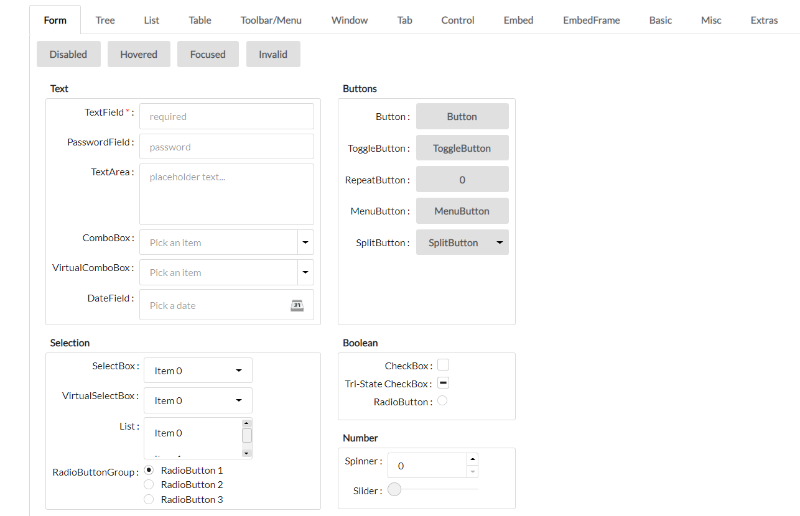

<!-- ABOUT THE PROJECT -->
# Ville.Clean

**ville.Clean** is a [Qooxdoo](https://qooxdoo.org/) theme inspired by [Semantic UI](https://semantic-ui.com/).

**Additional Benefits**
* Reduced reliance on external images for basic control graphics such as arrows, radio buttons and window buttons (all done with qooxdoo appearance and decoration entries)
* Leveraged SVG files for decoration images where possible to improve image sharpness
* Added control appearances for Buttons, TabViews and GroupBoxes (see Extra tab in the included widgetbrowser demo application)

**Form Controls**



<!-- GETTING STARTED -->
## Using the Theme in your Application
To use the Theme in your application, go into the application root directory and install the theme into your project:
```sh
$ qx package update
$ qx package list
$ qx package install sqville/ville.Clean
```
now you just have to modify your compile.json to enable the theme:
```sh
"applications": [
  {
    ...
    "theme": "ville.theme.Clean",
    ...
  }
],
```

<!-- DEMOS -->
## Demo
Using Qooxdoos [WidgetBrowser](https://sqville.github.io/ville.Clean/published/)


<!-- LICENSE -->
## License

Distributed under the MIT License. See `LICENSE` for more information.


<!-- CONTACT -->
## Contact

Chris Eskew - email: sqville@gmail.com
